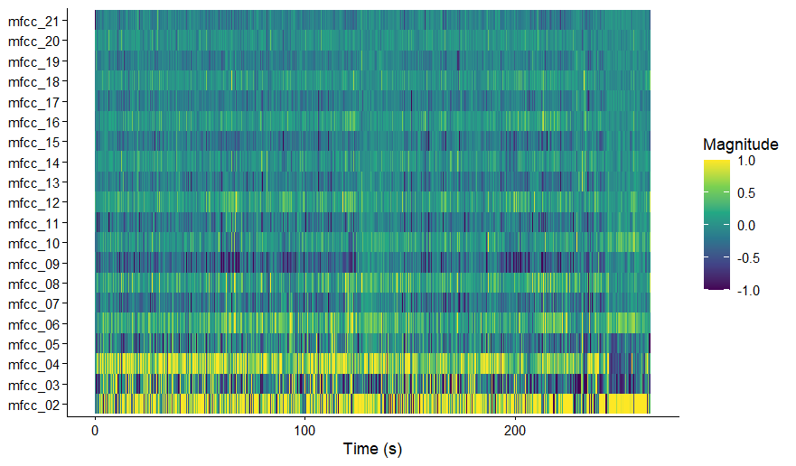
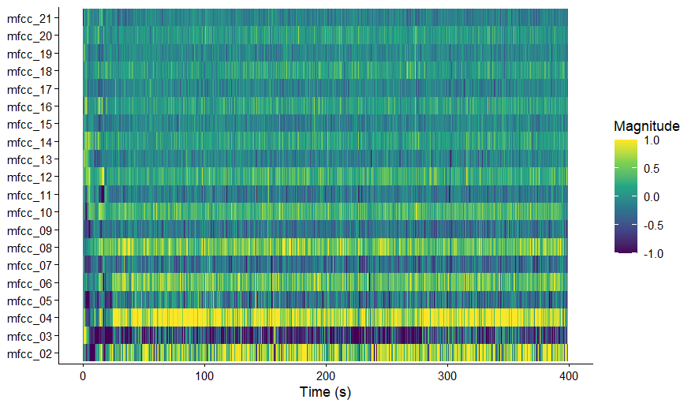

# Computational musicology portfolio
## Nienke-Maas
This is a cepstrogram for the song "Musicology" by Prince. The visualisation shows relatively stable MFCC patterns, with smooth colour transitions and few abrupt shifts. This means that there is not a lot of diversity in the timbre of the song, which matches with the audio.

This is a cepstrogram for the song "My name is Prince" by Prince. The visualisation shows more pronounced fluctuations across MFCC bands, with sharper contrasts and more transitions than the previous cepstrogram. This means that it has more diverse content regarding timbre.
