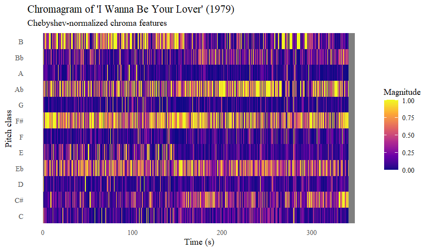
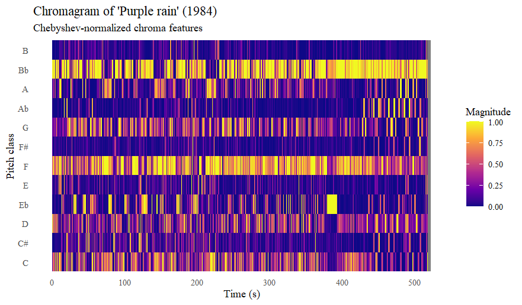
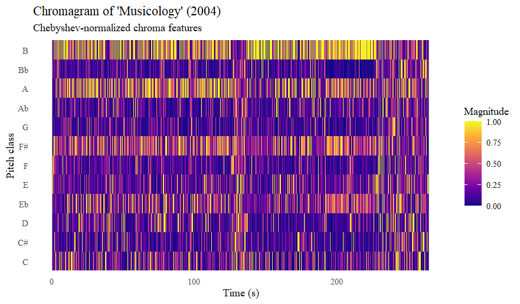
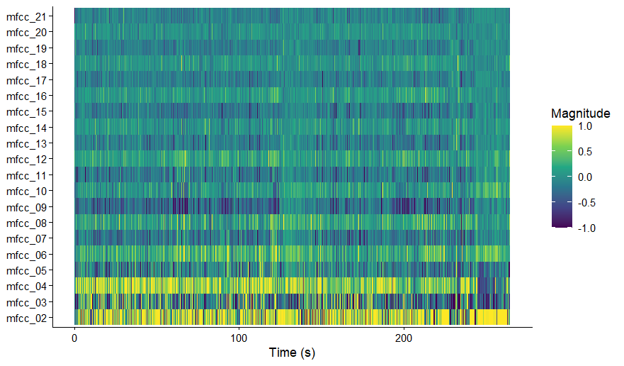
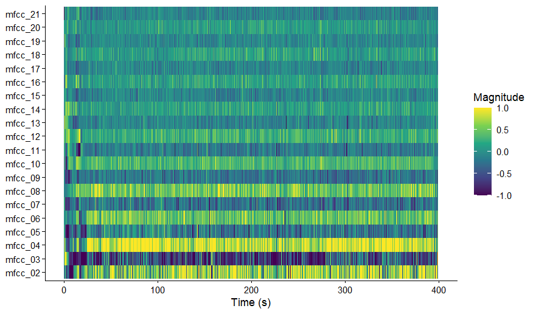
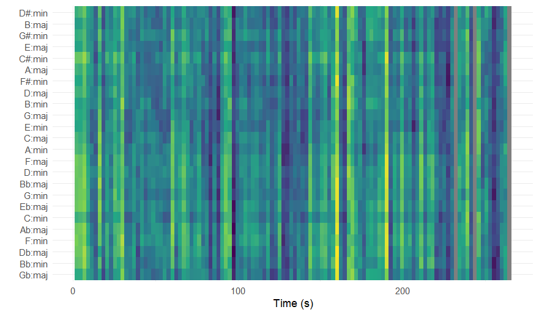
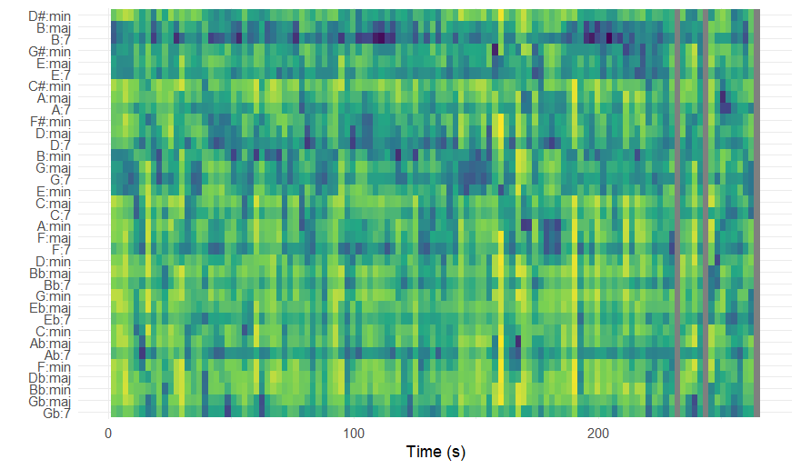
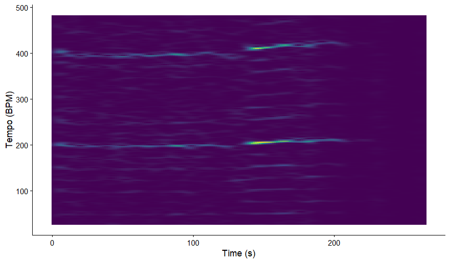

# Corpus description

## Column (width = 30%)

For my corpus, I use the complete discography of Prince. Prince's body of work spans more than four decades, from the late 1970's to the 2010's, and includes 39 studio albums and hundreds of tracks. His music is known for his stylistic diversity, blending funk, pop, rock, R&B and electronic influences. This makes his discography especially interesting for analysis: how do his musical characteristics evolve over time?

To test this, first an analysis of general patterns regarding energy, valence and mode was done to get an overall view of the corpus. Next, some songs were selected for more complex analyses regarding chroma features, timbre features, structure, tempo and beats. These songs were selected based on personal preference and representation of different times in Prince's musical career.

“I Wanna Be Your Lover,” from the album "Prince" (1979), represents the early phase of Prince’s career. The track combines disco-influenced rhythms, prominent bass lines and bright synthesizer textures, characteristic of late-1970s funk-pop production.

“Purple Rain,” the title track of "Purple Rain" (1984), represents the peak of Prince’s commercial and artistic success in the mid-1980s. The song differs significantly from his earlier work in its slower tempo, expansive structure and strong rock influence.

Finally, “Musicology,” from the album "Musicology" (2004), represents Prince’s later career and his return to a more traditional funk and soul-oriented sound. Compared to the earlier examples, the track features a tighter groove, modern production techniques and a rhythm section that emphasizes syncopation and groove.

Together, these three songs provide a balanced sample of Prince’s musical output across different decades, genres and production styles. Because they differ in tempo, structure, instrumentation and recording aesthetics, they offer a varied yet coherent set of examples for in-depth music information retrieval analysis. By examining these tracks alongside the broader corpus, it becomes possible to connect detailed feature-level analysis to larger patterns in Prince’s artistic development.

### Row (height = 20%)

# General patterns in corpus

## Column (width = 60%)

**Visualisation**

### Row

## Column

**Interpretation**

### Row

# Chroma features

## Column (width = 60%)

**Visualisations**

## Column

**Interpretation**

### Row

These visualisations show a comparison of the chromagram's of Prince's songs "My name is Prince" and "Musicology". I chose these songs because they are some of my favourite of Prince's discography, but they are in a very different style.\
The chromagram of "My name is Prince" shows that there is a wide variety of tones used throughout the entire piece: it does not follow the usual rules of using only a few chords that is traditional in western music. However, E, Bb and B do stand out slightly more. I think the reason for there being so many tones is because it contains a lot of rap (or rap-like singing) which is less focused on tone and more on rhythm.\
The chromagram of "Musicology" shows less diversity in tones, and a clearer adherence to the traditional tonal rules. Especially the tones B, A and F# stand out. What stands out in the chromagram are the two phases (around 125 seconds and at the end) where this tonal focus is a lot less strong. When listening to the song, the first interruption is a percussion section, where all melodic instruments stop playing and only a drumset and Prince's voice (speaking more than singing) can be heard. This explains why there is no clear tonal centre in that part. The ending is vague because there is a sort of intro for the next song, which does not match up with the rest of the song. It mainly contains speaking voice and fragments of other songs.

# Cepstrograms

## Column (width = 60%)

**Visualisations**

### Row (height = 50%)

Cepstrogram of the song "Musicology" by Prince 

### Row

Cepstrogram of the song "My name is Prince" by Prince 

## Column

**Interpretation**

### Row (height = 50%)

*Musicology*

The first visualisation is a cepstrogram for the song "Musicology" by Prince. The visualisation shows relatively stable MFCC patterns, with smooth colour transitions and few abrupt shifts. This means that there is not a lot of diversity in the timbre of the song, which matches with the audio.

### Row

*My name is Prince*

The second visualisation is a cepstrogram for the song "My name is Prince" by Prince. The visualisation shows more pronounced fluctuations across MFCC band, with sharper contrasts and more transitions than the previous cepstrogram. This means that it has more diverse content regarding timbre.

# Self-similarity matrix

## Column (width = 60%)

**Visualisations**

### Row

image

## Column

**Interpretation**

### Row

interpretation

# Key and chord estimation

## Column (width = 60%)

**Visualisations**

### Row

*"Musicology" keygram (Euclidean method, manhattan normalisation)*

### Row

*"Musicology" chordogram (Euclidean method, manhattan normalisation)*

## Column

**Interpretation**

### Row

*Key analysis*

This keygram shows an analysis for what key is most likely for "Musicology" by Prince. The analysis used key profiles as described in Temperley (1999), euclidean distance metrics and manhattan normalisation. The visualisation shows that there is no clear indication of a single key, although there is a band around the Emin-Cmaj-Amin area that shows relative stability. However, I think that due to the funky nature of the song, which contains a lot of complicated chords (not just major or minor), key estimation is hard.

### Row

*Chord analysis*

This chordogram shows an analysis for which chords are most prevalent in "Musicology" by Prince. The visualisation shows that B7 chords occur most frequently, and Bmin chords are also important. This is interesting, because that doesn't really correspond with the findings from the keygram. However, it could be the dominant chord in E minor, which would explain its many occurences. It is however weird that the E chord then doesn't come forward as much.

# Rhythm and tempo analysis

## Column

**Visualisations**

### Row

*"Musicology" tempogram (fourier-based)*

## Column (width = 60%)

**Interpretation**

### Row

The tempogram clearly shows an established tempo, there are lines around 200 bpm and 400 bpm. This is logical because of the nature of the analysis, where double the BPM is also fitting sufficiently to the sound waves. The tempogram shows a constant slight acceleration, which is not really audible in the song because it is so slight. This may indicate that the recording was not done using metronomes, so there is a slight human error.
